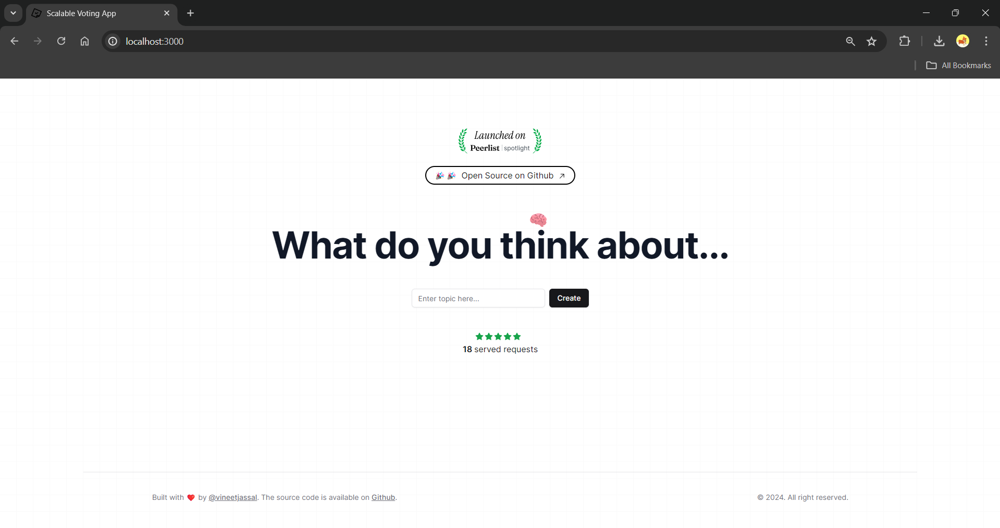
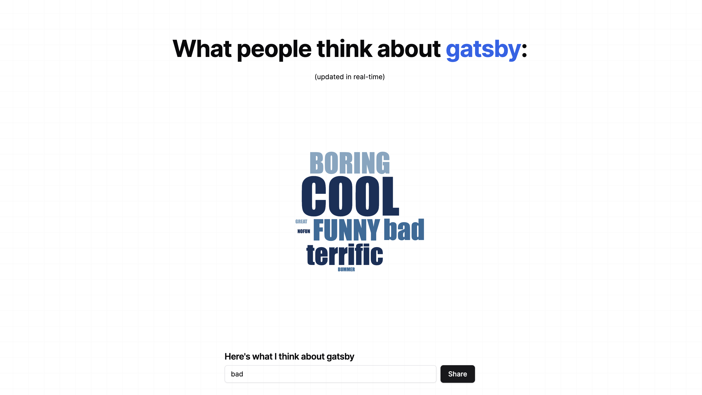

# Scalable Realtime Voting Application:

**DEMO:** [Link T0 YT](https://www.youtube.com/watch?v=2-DsiAT4-VM)

## Starting the client(navigate to `/client`):

  First, navigate to the `client` direcotory and run the development server:
  1. Add redis credentials( from [upstash](https://upstash.com/) ) in an `.env` file as:
```bash
UPSTASH_REDIS_REST_URL=""
UPSTASH_REDIS_REST_TOKEN=""
``` 
  2. Install the dependencies and modules:
```bash
npm install
```
  3. Start the nextjs project
```bash
npm run dev
```

## Starting the server(navigate to `/server`):
   1. Add redis credentials( from [upstash](https://upstash.com/) ) in an `.env` file as:
```shell
REDIS_CONNECTION_STRING =""
``` 
   2. Install the dependencies and modules:
```bash
npm install
```
  3. Start the server  (assuming you have typescript compiler installed locally )
```bash
tsc
nodemon dist/index.js
```

## Perview:



## Resources:
  To render votes : [WorldCloud](https://airbnb.io/visx/wordcloud) from airbnb
